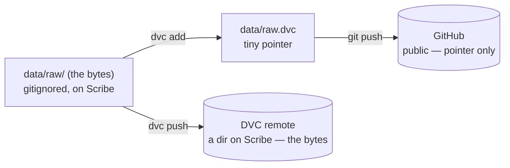

# Versioning data with DVC

Git versions your **code**; it deliberately never touches the restricted **data** (see
[Data safety](data-safety.md)). But sometimes you want the data versioned too — to be able to ask
*"which exact dataset produced the numbers in the March draft?"* and get it back. **DVC**
(Data Version Control) adds that, while keeping every byte of restricted data on Scribe.

!!! info "Status — an optional power tool"
    This is a personal experiment, not a lab requirement. DVC is worth it for a project with
    **evolving data you'll want to revisit** (re-runs, new waves, cleaning fixes). For a stable
    one-shot dataset, the normal gitignore-it-and-leave-it approach is simpler — skip this page.
    Drawn from a pilot on `belief_distortion_discrimination` and an end-to-end test of the Scribe
    setup.

!!! warning "git is a prerequisite"
    DVC's whole value comes from **git tracking a small pointer over time** (below). There's no
    point using DVC without git. If git on Scribe is new to you, read
    [Version control using git](git-for-newcomers.md) and [Local ↔ server sync](local-server-sync.md)
    first — this page assumes you're using git (Method B).

## The idea in one picture

DVC splits one dataset into two tracked things:

- **A pointer** — `data/raw.dvc`, about five lines (a content hash + size). Tiny, text,
  **git-tracked**, safe on public GitHub (it's a hash, not data).
- **The bytes** — stored in a content-addressed **cache**, and copied to a **remote** (a plain
  directory on Scribe). The real data folder stays **gitignored** — DVC does that for you.

So every data change is a **two-push rhythm** — git carries the pointer, DVC carries the bytes:



Because git versions the pointer at every commit, `git log data/raw.dvc` **is** your data's
version history — git does the small text, DVC stores the big bytes for each version.

!!! danger "The one rule that matters: the DVC remote must stay on Scribe"
    The lab's safety model — *code on GitHub, restricted data only on Scribe* — is enforced on the
    **git** channel ([the pre-push hook](local-server-sync.md#protecting-data-on-the-server-the-pre-push-hook)).
    `dvc push` is a **second channel** that hook can't see. If a DVC remote ever pointed off-Scribe
    (S3, Google Drive, a laptop), `dvc push` would send restricted student data off the server — a
    FERPA-class leak. **Always keep the DVC remote a directory under `/home/research/ca_ed_lab/`.**
    The setup below configures and *enforces* this.

## Folder layout

Track the **subdirectories** of `data/`, not the whole folder — so `data/` itself stays in git
(for the pointers and docs) while the actual data is ignored:

```
data/
├── raw/            ← dvc add data/raw   → bytes go to DVC; "/raw" added to data/.gitignore
├── raw.dvc         ← pointer (git-tracked, safe to push)
├── cleaned/        ← dvc add data/cleaned
├── cleaned.dvc
├── MANIFEST.md     ← what's here (git-tracked)
├── PROVENANCE.md   ← where it came from; IRB / access (git-tracked)
└── CHANGELOG.md    ← why versions changed (git-tracked)
```

The pointers and the `MANIFEST/PROVENANCE/CHANGELOG` docs are safe to commit; the data isn't. The
[pre-push hook](#how-the-guards-protect-you) knows that distinction.

## One-time setup

Three small scripts ship with this guide (`dvc-egress-guard.sh`, `dvc-sync-check.sh`,
`setup-dvc-server.sh`, plus the `pre-push` hook). From inside your project folder on Scribe, with
git already set up:

```bash
REMOTE_PATH=/home/research/ca_ed_lab/data/<project>/dvc-remote ./setup-dvc-server.sh
```

`setup-dvc-server.sh` is idempotent and does it all: checks you're in a git repo, runs `dvc init`,
configures a **group-shared, hardlinked cache** (so members on the shared project folder don't each
duplicate the data), adds the **on-Scribe remote**, verifies it isn't off-server, and installs the
**DVC-aware `pre-push` hook + guards** into `.githooks/`. It refuses a `REMOTE_PATH` that isn't
under the lab root.

## Daily workflow

```bash
# after the data changes (a new wave, a cleaning fix, ...)
dvc add data/raw                       # re-hash → updates data/raw.dvc + caches the bytes
dvc push                               # bytes → the on-Scribe remote   ← don't forget this half

git add data/raw.dvc data/raw/.gitignore
git commit -m "data: refreshed raw extract"
git push                               # pointer → GitHub

# before you log off
./.githooks/dvc-sync-check.sh          # "in sync" = safe; warns if bytes weren't pushed
```

!!! tip "The forgotten `dvc push` is the classic mistake"
    `git push` and `dvc push` are **two separate operations**. If you push the pointer but forget
    the bytes, anyone who clones gets a pointer to data that exists only on your machine — a
    *dangling pointer*. `dvc-sync-check.sh` (and the pre-push hook) catch this; `dvc status -c`
    is the one-line manual check.

## Going back to an old version

```bash
git checkout <old-commit> -- data/raw.dvc   # restore the old pointer
dvc checkout data/raw.dvc                    # materialize the data that pointer names
# ... when done, return to the latest:
git checkout HEAD -- data/raw.dvc && dvc checkout data/raw.dvc
```

!!! tip "Tag the versions you must never lose"
    Tag the commit behind a submitted paper (`git tag jmp-submission`). Then the cache cleanup
    below can never drop that data version.

## Keeping the cache from snowballing

The cache keeps every version's bytes, so it grows — but with **churn, not size × versions**:
identical files across versions are stored once, so editing 2 of 200 files adds ~2 files, not a
whole new copy. When it needs trimming:

```bash
dvc gc -A          # prune blobs not referenced by ANY git commit/branch/tag (conservative)
dvc gc -A -c       # also prune the on-Scribe remote
```

!!! warning "`dvc gc` deletes"
    Anything not referenced by the scope you choose is gone. `-A` (all commits) keeps every version
    your git history points to — pair it with the tagging habit above. On a shared project this is
    a natural data-steward task; "keep everything forever" vs "gc to tagged releases" is a policy to
    decide per project, not drift into.

## A gotcha: tracked files are read-only

With the hardlinked cache, DVC checks data files out **read-only** (to protect the shared cache).
Stata scripts that *regenerate* outputs to fresh files are fine. But to edit a tracked file **in
place** you must unlock it first:

```bash
dvc unprotect data/raw        # make it writable
# ... edit / overwrite ...
dvc add data/raw              # capture the new version
```

## How the guards protect you

Setup installs one `pre-push` hook that does two jobs (it extends the lab's existing data-egress
hook, so install it where you don't already have one — otherwise add its two guard calls to yours):

1. **Blocks restricted data on the git channel** — refuses a push carrying a real file under
   `data/` or `estimates/`, *with a carve-out* so `*.dvc` pointers, `data/.gitignore`, and the
   `MANIFEST/PROVENANCE/CHANGELOG` docs go through. (Faithful to the hook in
   [Data safety](data-safety.md) / [Local ↔ server sync](local-server-sync.md).)
2. **Blocks the DVC channel** — `dvc-egress-guard.sh` refuses the push if any DVC remote points
   off-Scribe, and `dvc-sync-check.sh` warns about unpushed bytes.

To override in a genuine emergency (audited via shell history): `git push --no-verify`.

## When NOT to bother

- The dataset is stable and you'll never revisit old versions → plain gitignore is simpler.
- You don't use git → DVC has nothing to hang its versioning on; start with
  [git](git-for-newcomers.md) first.
- You only need an off-machine backup, not history → that's a job for the lab's normal backup, not DVC.

---

!!! note "Porting note (delete before publishing)"
    Draft for `cel_resource_hub/docs/workflow-tips/`. Before publishing: (1) place the four scripts
    where the hub wants them and fix the `./setup-dvc-server.sh` / `./.githooks/...` paths; (2)
    confirm the cross-link filenames; (3) `mkdocs build --strict`; (4) add to `mkdocs.yml` nav.
    Lab-deployment specifics (datastore backup, per-project groups) are intentionally left as
    "configure per your lab's setup" — adoption is the lab's call.
